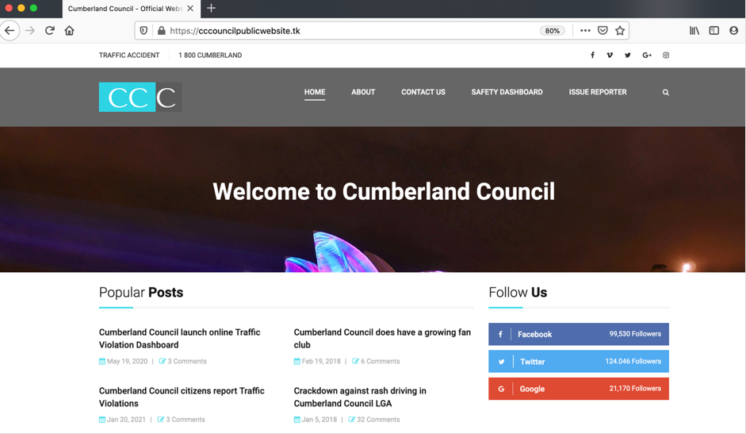

# Cumberland City Council Public Website

Cumberland County is a county in the State of New South Wales, Australia. Most of the Sydney metropolitan area is located within the County of Cumberland. The County of Cumberland stretches from Broken Bay to the north, the Hawkesbury River to the north-west, the Nepean River to the west, the Cataract River to the south-west and the northern suburbs of Wollongong to the south. It includes the area of the Cumberland Plain.

The public website includes the following sections:  

- Home  
- About  
- Contact Us  
- Safety Dashboard  
- Issue Reporter  
- Suburbs  
- Recent News  
- Copyright notification  
- Terms of Use  
- Privacy Policy  

Copyright ©2021 All rights reserved 
